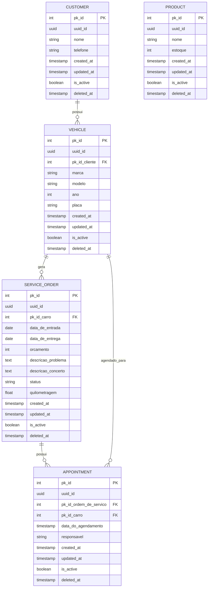

# PitStop Manager - Arquitetura Técnica

## 🏗️ Visão Geral da Arquitetura

O PitStop Manager segue uma arquitetura modular baseada em Django Apps, implementando conceitos de Domain-Driven Design (DDD) e Clean Architecture.

## 📁 Estrutura de Diretórios

```
PitStopManager/
├── apps/                           # Aplicações Django
│   ├── core/                      # App base - utilitários e modelos abstratos
│   │   ├── models.py             # TimeStampedModel, SoftDeleteModel
│   │   ├── utils.py              # Validadores e formatadores
│   │   ├── views.py              # Views base e dashboard
│   │   ├── urls.py               # URLs do core
│   │   └── admin.py              # Configurações admin base
│   ├── customers/                 # Domínio de Clientes
│   │   ├── models.py             # Customer
│   │   ├── views.py              # CRUD de clientes
│   │   ├── forms.py              # Formulários de cliente
│   │   ├── urls.py               # URLs de clientes
│   │   └── admin.py              # Admin de clientes
│   ├── vehicles/                  # Domínio de Veículos
│   │   ├── models.py             # Vehicle
│   │   ├── views.py              # CRUD de veículos
│   │   ├── forms.py              # Formulários de veículo
│   │   ├── urls.py               # URLs de veículos
│   │   └── admin.py              # Admin de veículos
│   ├── services/                  # Domínio de Serviços
│   │   ├── models.py             # ServiceOrder
│   │   ├── views.py              # CRUD de ordens de serviço
│   │   ├── forms.py              # Formulários de OS
│   │   ├── urls.py               # URLs de serviços
│   │   └── admin.py              # Admin de serviços
│   ├── inventory/                 # Domínio de Estoque
│   │   ├── models.py             # Produtos
│   │   ├── views.py              # CRUD de estoque
│   │   ├── forms.py              # Formulários de produto
│   │   ├── urls.py               # URLs de estoque
│   │   └── admin.py              # Admin de estoque
│   └── scheduling/                # Domínio de Agendamentos
│       ├── models.py             # Appointment
│       ├── views.py              # CRUD de agendamentos
│       ├── forms.py              # Formulários de agendamento
│       ├── urls.py               # URLs de agendamentos
│       └── admin.py              # Admin de agendamentos
├── config/                        # Configurações do projeto
│   ├── settings/                 # Settings por ambiente
│   │   ├── base.py              # Configurações base
│   │   ├── development.py       # Configurações de desenvolvimento
│   │   ├── production.py        # Configurações de produção
│   │   └── testing.py           # Configurações de teste
│   ├── urls.py                   # URLs principais
│   ├── wsgi.py                   # WSGI para deploy
│   └── asgi.py                   # ASGI para funcionalidades assíncronas
├── templates/                     # Templates HTML
│   ├── base.html                # Template base
│   ├── customers/               # Templates de clientes
│   ├── vehicles/                # Templates de veículos
│   ├── services/                # Templates de serviços
│   ├── inventory/               # Templates de estoque
│   └── scheduling/              # Templates de agendamentos
├── static/                       # Arquivos estáticos
│   ├── css/                     # Estilos CSS
│   ├── js/                      # JavaScript
│   └── img/                     # Imagens
├── media/                        # Uploads de arquivos
├── requirements/                 # Dependências por ambiente
└── docs/                        # Documentação
```

## 🔧 Modelos Abstratos Base

### TimeStampedModel
```python
class TimeStampedModel(models.Model):
    """Modelo abstrato para timestamps automáticos"""
    created_at = models.DateTimeField(auto_now_add=True)
    updated_at = models.DateTimeField(auto_now=True)
    
    class Meta:
        abstract = True
```

### SoftDeleteModel
```python
class SoftDeleteModel(TimeStampedModel):
    """Modelo abstrato para soft delete com ActiveManager"""
    is_active = models.BooleanField(default=True, verbose_name='Ativo')
    deleted_at = models.DateTimeField(null=True, blank=True, verbose_name='Deletado em')
    
    objects = models.Manager()
    active_objects = ActiveManager()
    
    def delete(self, using=None, keep_parents=False):
        """Soft delete - marca como inativo"""
        self.is_active = False
        self.deleted_at = timezone.now()
        self.save(using=using)
    
    def hard_delete(self, using=None, keep_parents=False):
        """Delete real do registro"""
        super().delete(using=using, keep_parents=keep_parents)
```

### ActiveManager
```python
class ActiveManager(models.Manager):
    """Manager para filtrar apenas registros ativos"""
    def get_queryset(self):
        return super().get_queryset().filter(is_active=True)
```

## 📊 Diagrama de Entidades (ER Implementado)



## 🎯 Padrões de Design Implementados

### 1. **Domain-Driven Design (DDD)**
- **Agregados**: Customer, Vehicle, ServiceOrder, Product, Appointment (modelos principais definidos)
- **Entidades**: Cada modelo principal com identidade única (UUID implementado)
- **Value Objects**: Formatação básica de telefone implementada

### 2. **Repository Pattern**
- **ActiveManager**: Implementado para filtrar registros ativos (get_queryset com is_active=True)
- **Soft Delete**: Implementado em todos os modelos principais via SoftDeleteModel
- **Dual Managers**: objects (todos) e active_objects (apenas ativos)

### 3. **Padrões Django Implementados**
- **Model-View-Template (MVT)**: Arquitetura padrão Django
- **Apps Modulares**: Separação por domínio de negócio
- **Abstract Base Classes**: TimeStampedModel e SoftDeleteModel
- **Foreign Key Relationships**: Relacionamentos entre entidades

## 🔄 Fluxo de Dados Implementado

### 1. **CRUD Básico por Entidade**
```
Customer: Create → Read → Update → Soft Delete
Vehicle: Create → Read → Update → Soft Delete (relacionado a Customer)
ServiceOrder: Create → Read → Update → Soft Delete (relacionado a Vehicle)
Product: Create → Read → Update → Soft Delete
Appointment: Create → Read → Update → Soft Delete (relacionado a ServiceOrder e Vehicle)
```

## 🗄️ Banco de Dados Implementado

### Características dos Modelos
- **UUID**: Todos os modelos principais têm campo uuid_id único
- **Soft Delete**: is_active + deleted_at em todos os modelos
- **Timestamps**: created_at/updated_at automáticos via TimeStampedModel
- **Relacionamentos**: ForeignKeys com related_names configurados

## 🔐 Segurança e Validações

### Validações de Entrada
```python
# Formatadores implementados
def format_phone(phone): 
    """Formata número de telefone para padrão brasileiro"""
    # Remove caracteres não numéricos
    # Aplica máscara (11) 99999-9999

# Validadores de modelo (implementados nos models)
class Customer(SoftDeleteModel):
    def clean(self):
        # Validação de nome obrigatório
        # Validação de telefone

class Vehicle(SoftDeleteModel):
    def clean(self):
        # Validação de placa brasileira
        # Validação de ano (1900-presente)
        
class ServiceOrder(SoftDeleteModel):
## 🔐 Funcionalidades de Validação Implementadas

### Formatação Automática
```python
# Formatador implementado em apps/core/utils.py
def format_phone(phone): 
    """Formata número de telefone para padrão brasileiro"""
    # Remove caracteres não numéricos e aplica máscara
```

### Middleware de Segurança Django
- **CSRF Protection**: Ativo em formulários

## 🏗️ Configuração e Ambiente

### Gerenciamento de Dependências
- **UV**: Gerenciador moderno de dependências Python
- **pyproject.toml**: Configuração centralizada do projeto

---

*Documentação técnica atualizada em 02/07/2025*
